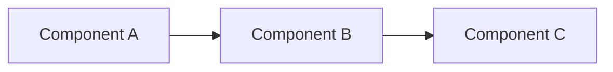

# EDD Templates and Patterns

This reference file contains EDD templates and patterns observed in this project's existing EDDs. Use these as guides when creating new EDDs.

## Standard EDD Template

```markdown
# EDD-{NUMBER}: {Feature Name}

**File**: `docs/EDD/{NUMBER}-{kebab-case-name}.md` (use sequential number)
**Created**: {YYYY-MM-DD}
**Status**: 🚧 In Progress | ✅ Complete | 🔄 In Review
**Last Updated**: {YYYY-MM-DD}
**Type**: Frontend | Backend | Full-Stack | Infrastructure

## SUMMARY

{2-4 sentences clearly explaining what will be built and why. Focus on WHAT will happen, not goals or criteria.}

Example:
"This implements CAM assignment synchronization from HubSpot to COS. When a `company.propertyChange` webhook arrives with `cam_owner` updates, the handler validates and stores the event, then the worker fetches CAM details from HubSpot and updates the corresponding counterparty in COS via API call."

## TECHNICAL SPECIFICATIONS

### Affected Files

**CREATE:**
- `{relative/path/to/file}` - {Description}

**MODIFY:**
- `{relative/path/to/file}` - {Description}

**DELETE:**
- `{relative/path/to/file}` - {Description}

### Architecture & Design

#### For Backend Projects:

**API Operations:**

##### 1. {Operation Name}
- **Operation ID**: `{Namespace}_{operationName}`
- **Method**: GET | POST | PUT | DELETE
- **Route**: `/{path}`
- **Request**: {Path/Query parameters or Request body type}
- **Response**: {Response type}
- **Logic**: {1-2 sentences on approach}

**Service Layer Approach:**
- {Service class/module names and responsibilities}
- {Key method signatures}
- {Integration points}

**DynamoDB Schema** (if applicable):
- **Entity**: {EntityName}
- **Primary Key**: pk: {composite}, sk: {composite}
- **GSI**: {if needed}

#### For Frontend Projects:

**Component Hierarchy:**
```
{ParentComponent}
├── {ChildComponent1}
└── {ChildComponent2}
```

**State Management:**
- **Store**: {StoreName} (Pinia, Composition API style)
- **Key State**: {State properties}
- **Key Actions**: {Actions}

**Data Flow:**
{Brief description of how data flows through the system}

### Components

#### Component 1: {Name}
- **Purpose:** {What it does}
- **Location:** {File path}
- **Key responsibilities:**
  - {Responsibility 1}
  - {Responsibility 2}

### Data Flow

1. {Step 1 with data}
2. {Step 2 with data}
3. {Step 3 with data}



### API Contracts (if applicable)

**Request:**
```json
{
  "field": "value"
}
```

**Response:**
```json
{
  "result": "value"
}
```

### TypeSpec Changes (if applicable)

**Files to modify:**
- `typespec/{service-name}/{file}.tsp`

{Show namespace and operation signatures - NOT full implementations}

### Dependencies & Prerequisites

**New Packages** (if any):
```bash
npm install {package-name}@{version}
```

**Environment Variables** (if any):
```bash
VITE_{VARIABLE_NAME}={description}
```

**Coding Standards:**
All code MUST follow project standards:
- TypeScript: `.claude/rules/typescript.md`
- CDK: `.claude/rules/cdk.md`
- Project: `CLAUDE.md` and `.claude/rules/development.md`

## IMPLEMENTATION PHASES

### Phase 1: {Phase Name}

**Objective**: {What this phase achieves}

**Can Execute in Parallel**: ❌ No (or ✅ Yes)

**Tasks**:
- [ ] Task 1: {Specific, actionable task}
  - File: `{relative/path/to/file}`
  - Notes: {Implementation details}
- [ ] Task 2: {Specific, actionable task}
  - File: `{relative/path/to/file}`
  - Notes: {Implementation details}

**Validation**:
- [ ] {Validation step 1}
- [ ] {Validation step 2}
- [ ] Type-check passes (`npm run test:tsc`)
- [ ] Linting passes (`npm run lint`)

---

### Phase 2: {Phase Name}

**Objective**: {What this phase achieves}

**Can Execute in Parallel**: ✅ Yes - {reason}

**Tasks**:
- [ ] Task 1: {Specific, actionable task}
  - File: `{relative/path/to/file}`
  - Parallel with: Task 2, Task 3
  - Notes: {Implementation details}

**Validation**:
- [ ] {Validation step 1}
- [ ] Type-check passes
- [ ] Linting passes

---

## TESTING & VALIDATION

### Unit and Integration Testing
- [ ] `npm test` passes (all workspaces)
- [ ] `npm run test -w packages/{service-package}` passes
- [ ] `npm run fix` auto-fixes any linting issues
- [ ] Manual testing checklist:
  - [ ] {Test case 1}
  - [ ] {Test case 2}

### Local Testing
- [ ] `npm start` - dev server runs successfully
- [ ] Integration tests with curl/Postman:
  ```bash
  curl -X {METHOD} http://localhost:3000/{path} \
    -H "Content-Type: application/json" \
    -d '{request-body}'

  # Expected: {response}
  ```

### CDK Testing (if applicable)
- [ ] `npm run cdk:validate` passes
- [ ] `npm run cdk:synth` succeeds without errors

### End-to-End Testing
- [ ] {E2E test scenario 1}
- [ ] {E2E test scenario 2}

## RISKS & MITIGATIONS

| Risk | Impact | Probability | Mitigation |
|------|--------|-------------|------------|
| {Risk description} | High/Medium/Low | High/Medium/Low | {How we address it} |

## IMPLEMENTATION NOTES

### Deployment Order
1. Deploy {component} first
2. Then deploy {component}
3. Finally enable {feature flag}

### Rollback Plan
If issues occur:
1. {Rollback step 1}
2. {Rollback step 2}

### Monitoring
- CloudWatch alarms for {metrics}
- Slack alerts to #{channel}

## OPEN QUESTIONS

- [ ] {Question that needs answering before/during implementation}
- [ ] {Another open question}

## REFERENCES

- TypeScript Standards: `.claude/rules/typescript.md`
- CDK Standards: `.claude/rules/cdk.md`
- Development Workflow: `.claude/rules/development.md`
- Project Overview: `CLAUDE.md`
- Related EDDs: {links}
- External docs: {links}
```

## Pattern: Lambda Handler Feature

When adding a new feature to an existing Lambda handler:

### Minimal EDD Structure

```markdown
# EDD-{NUMBER}: {Feature Name}

## Overview
{What this adds to existing handler}

## Requirements
- Extend handler to process {new event type}
- Call {downstream API} with {data}
- Handle {error scenarios}

## Design

### Changes to Handler
- Add event type check for `{event_type}`
- Extract {fields} from event payload
- No schema changes needed (existing fields sufficient)

### Changes to Worker
- Add conditional logic for `{event_type}` events
- Call {API}: `{METHOD} {endpoint}` with payload:
  ```json
  { "field": "value" }
  ```
- Same retry/error handling as existing flows

### Data Flow
[Simple numbered list, no complex diagrams needed]

## Testing Strategy
- Unit test: Handler identifies {event_type} correctly
- Integration test: End-to-end flow processes {event_type}
- Manual test: Trigger webhook from {source}, verify {outcome}

## Risks
- Low risk - follows existing patterns
- Mitigation: Reuse existing error handling, monitoring, alarms

## Implementation Notes
- Can reuse existing constructs (Lambda, SQS, DynamoDB)
- Deploy as normal Lambda code update (no infrastructure changes)
```

## Pattern: New Infrastructure Component

When adding new AWS infrastructure:

### Comprehensive EDD Structure

```markdown
# EDD-{NUMBER}: {Component Name}

## Overview
{Why this new infrastructure is needed}

## Requirements
{Detailed requirements since this is new infrastructure}

## Design

### Architecture Overview
[Include Mermaid diagram showing how this fits into existing architecture]

### CDK Stacks

#### New Stack: {StackName}
- **Location:** `cdk/stacks/{name}.ts`
- **Resources:**
  - {Resource 1} - {Purpose}
  - {Resource 2} - {Purpose}
- **Dependencies:**
  - Depends on {OtherStack} for {reason}

### Resource Configuration

#### {Resource Type} ({Logical ID})
```typescript
new ResourceType(this, 'LogicalId', {
  property: value,
  // Key configuration
})
```

**Rationale:** {Why configured this way}

### Cross-Account Access (if applicable)
- IAM roles created in both accounts
- Trust relationships established
- See [cross-account pattern](../../.claude/rules/cdk.md#cross-account-patterns)

## Testing Strategy
- CDK synth succeeds
- CDK tests validate IAM policies
- Deploy to dev, verify resources created
- Manual testing: {specific tests}

## Risks
- **Deployment risk:** New infrastructure could fail
  - Mitigation: Deploy to dev first, validate before prod
- **Cost risk:** {Resource} charges for {usage}
  - Mitigation: Set budget alerts, review after 1 week

## Implementation Notes

### Deployment Order
1. Deploy CDK stack to dev
2. Test thoroughly
3. Deploy to alpha, beta
4. Manual approval for prod
5. Monitor for 24 hours after prod deployment

### Rollback Plan
```bash
cdk destroy {StackName} --profile {profile}
# Then revert git commit
```

### Monitoring
- CloudWatch alarms for {metrics}
- Slack alerts to #{channel}
```

## Observed Patterns from This Project

### From EDD-001 (CAM Assignments)

**Good patterns:**
- Clear business context in Overview
- Explicit scope boundaries (what's included, what's not)
- Concrete API examples with actual endpoints
- Mermaid diagrams for data flow
- Specific test scenarios

**Structure used:**
1. Executive Summary (business context)
2. Goals / Non-Goals (clear boundaries)
3. Architecture (technical design)
4. Implementation Phases (incremental delivery)
5. Open Questions (unresolved items)

### From EDD-002 (Project Bootstrap)

**Good patterns:**
- Heavy focus on "why" not just "what"
- Decision rationale documented
- Alternative approaches considered and rejected
- Clear migration path from old to new

**Structure used:**
1. Context (problem being solved)
2. Decision (what we're doing)
3. Consequences (trade-offs accepted)
4. Alternatives Considered (why not those)

### From EDD-003 (Monorepo Migration)

**Good patterns:**
- Before/after directory structures
- Step-by-step migration procedure
- Validation checklist after each phase
- Rollback instructions

**Structure used:**
1. Motivation (why migrate)
2. Current State (before)
3. Target State (after)
4. Migration Steps (how)
5. Validation (testing)

## Common EDD Anti-Patterns

**❌ Avoid:**
- Restating what the code does without explaining why
- Over-documenting implementation details (code is the source of truth)
- Creating EDDs for trivial changes (use PR descriptions instead)
- Leaving Open Questions unresolved at implementation time
- Writing implementation guide (that's what code comments are for)

**✅ Prefer:**
- Explaining architectural decisions and trade-offs
- Documenting non-obvious design choices
- Capturing business context and requirements
- Resolving Open Questions before writing code
- Linking to relevant RFCs, ADRs, or other EDDs

## When to Create an EDD

**Create an EDD when:**
- Adding a new feature with business impact
- Making significant architectural changes
- Integrating with external systems
- Requires input from multiple stakeholders
- Implementation will span multiple PRs
- Design decisions need documentation

**Skip the EDD when:**
- Fixing bugs (use PR description)
- Refactoring without behavior change
- Trivial UI changes
- Documentation updates
- Dependency upgrades

## EDD Lifecycle

1. **Draft:** During design, sections validated incrementally
2. **Review:** User approves final design
3. **Implementation:** EDD guides development, Open Questions resolved
4. **Completion:** EDD archived as design record
5. **Maintenance:** Update EDD if design significantly diverges during implementation

**Note:** EDDs are design documents, not living documentation. Code and CLAUDE.md are the source of truth for current implementation.
